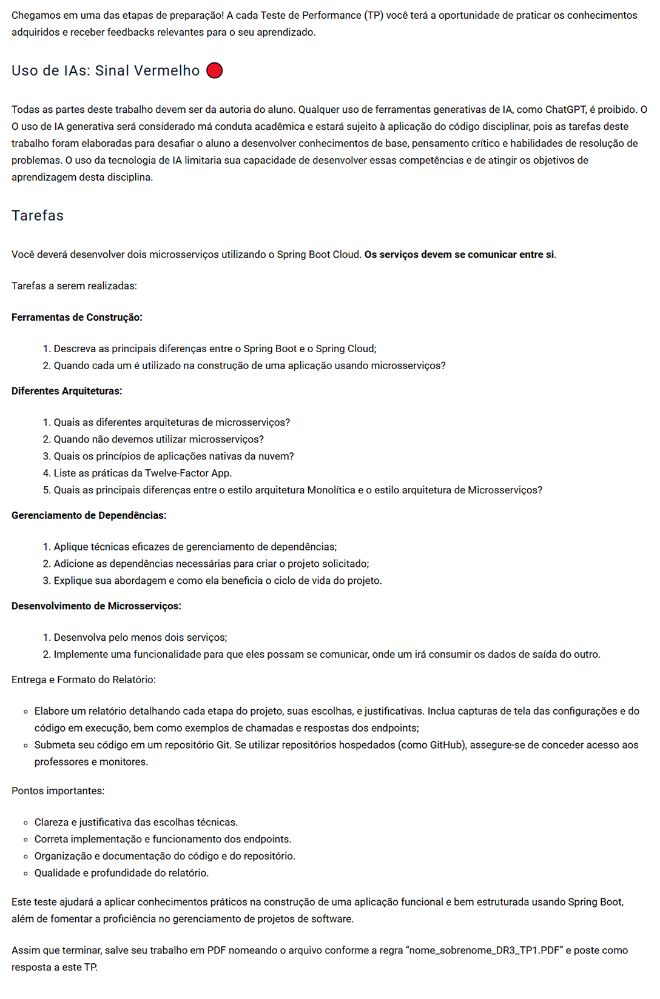

# Microsserviços e DevOps com Spring Boot e Spring Cloud

# TP1 - Questões (4)

# Informações:
Dentro do TP1 foram criados dois microsserviços:
1. **service-a** na **porta 8081**
2. **service-b** na **porta 8082**

O **service-a** exporta um mensagem padrão e o **service-b** obtém a mensagem padrão e acrescenta o nome do usuário na mensagem

## Como testar
1.	Inicie o service-a e acesse no navegador:
      http://localhost:8081/greeting
      
Resultado:
    
    Olá, bem-vindo

2.	Inicie o service-b e acesse no navegador:
      http://localhost:8082/welcome?name=Samuel

Resultado:

    Olá, bem-vindo Samuel!

